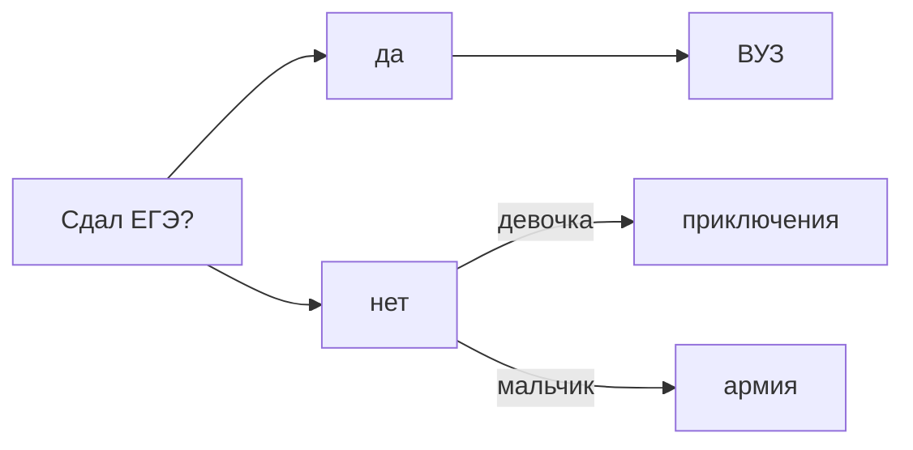

# taya02.github.io
Ссылка на вк https://vk.com/t.kuteneva

*люблю пить чай*

<a href="https://github.com/taya02/taya02.github.io" class="button_1670306201441" target="_blank">
  Нажми
</a>

 http://chemtaya.tilda.ws

